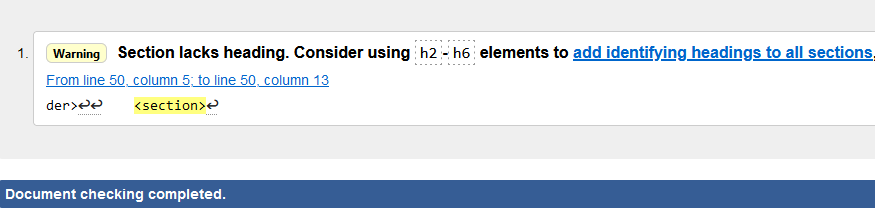
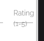

<h1 align=center> Live Music Reviews App</h1>

[View the live project here.](https://live-music-reviews.herokuapp.com/)


## Technologies Used

 - [HTML5](https://en.wikipedia.org/wiki/HTML5)
 - [CSS3](https://en.wikipedia.org/wiki/CSS)
 - [Materialize](https://materializecss.com/) responsive front end framework.
 - [Font Awesome](https://fontawesome.com/) free icons.
 - [Google Fonts](https://fonts.google.com/) font imports.
 - [Javascript](https://en.wikipedia.org/wiki/JavaScript) with [jQuery](https://jquery.com/)
 - [Python](https://www.python.org/) with [Flask](https://flask.palletsprojects.com/en/2.1.x/) to access and manipulate data records.
 - [MongoDB](https://www.mongodb.com/) database program to store data records.
 - [Gitpod](https://gitpod.io) is the IDE used to write the code.
 - [Git](https://git-scm.com/) version control to commit files to local repository and push files to Github and Heroku repositories.
 - [Github](https://github.com/) stores project files externally from the IDE after being pushed.
 - [Heroku](https://www.heroku.com/) used to deploy the application to the live site.

## User Experience
### User Goals
- A first time visitor will be able to easily navigate the site, viewing/searching for live music reviews left by other users and creating their own user account.
- A returning visitor will be able to log in to their account, leave their own review(s) and update/remove their own reviews. 

### Site Owner Goals
- Have multiple visitors create accounts and share their live music experiences for anyone to view. 
- Share their own live music experiences. 

### Wireframes
*First mock ups hand drawn and later turned into digital wireframes with [wireframe|cc](https://wireframe.cc/).*

- [Home Page](static/images/lmr_wireframe_home.png)
- [My Reviews](static/images/lmr_wireframe_my_reviews.png)
- [Add Review](static/images/lmr_wireframe_add_review.png)

There was no need for design for smaller view widths as the app uses Materialize css framework to make html elements render responsively. 

## Testing
- CSS passes [W3 CSS Validator](https://jigsaw.w3.org/css-validator/).
- All HTML pages pass [W3 HTML Validator](https://validator.w3.org/) with no errors, one warning shows (pictured below) saying a section should have a heading element. The section is for flash messages and when there are no messages shown on the page, the section will be empty in the html which causes this warning but is not an issue. 


### Functionality
Functionality created in the app.py python file was tested each time a new feature was added, by using the Preview in Gitpod (in Gitpod terminal type 'python3 app.py' and select Open Preview to view the app in current stage). 

For every function that requires sending or getting data from the database I performed a simple test.
- For user registration I can create a new account and check the 'users' data set in my MongoDB cluster and see that the values input to the html form have been imported to the database and set to the correct keys. 
- For users to add a new review I created a review on multiple accounts and once again checked all the correct user input values are being sent to the correct data set in the database, creating a new dictionary document.
- For editing a review it is the same as above, but checking the values have been updated inside the correct document. 
- For deleting a review I can delete a review from the site and make sure the document has been removed from the database.
- For displaying reviews on the home page I made sure all reviews inside the data set were being displayed in the html on the page. 
- For displaying a user specific reviews I can check that the 'created_by' key in each review shown has the same value as the current_user account. I can log to other accounts and check only their reviews are shown and others are not.

All Navigation links, both in full size and side-nav on smaller view widths, were tested periodically during the development process to ensure they always worked.

CSS was tested as elements were created/classes were added through viewing the Preview in browser. Using dev tools to test responsive design. Any bugs were minor and required simple fixes using the Materialize framework, changing grid assignment of elements so that everything looks visually appealing. 

Known Bugs: 
- The input field label for 'rating' on the add_review and edit_review pages overflows outside of the element on small view widths. The label is neccessary for the user to know what they are inputing and the values they can use. It could be moved down to the next line however I feel it ruins the look of the form. The Materialize grid assignment for 'rating' section and the 'review_content' could be edited to give more width to the rating however this would leave the textarea input for a users review quite small which is not preferable. 



- When coding a modal to open when 'DELETE' was clicked, I couldn't get the modal to delete the correct review dictionary, it would always delete the first one in the data set. I ended up using this fix, found on Slack by igor_ci:

"If however you're using the modal in a list of items (created by a for-loop from Mongo), then you need to make every modal's ID unique (both in the modal itself and in the button that triggers it), in order to make sure that the correct modal is triggerred and the correct item deleted.
If you don't do this, it will always be the same (first) modal that is triggerred, and the same (first) item that is deleted.
The easiest way to do this, if the items are inside a Jinja for-loop, is to use {{ loop.index }}, like this (Bootstrap example):"

button:
```html
<button ... data-target="#exampleModal{{ loop.index }}">

</button>
```
modal:
```html
<div class="modal fade" id="exampleModal{{ loop.index }}" .....>
</div>
```

## Deployment with Heroku
- You need a [Heroku](https://www.heroku.com/) account.
- Use Git to push local repository to Heroku remote repository. [Here is Heroku documentation for installing and using heroku in command line interface](https://devcenter.heroku.com/articles/heroku-cli).
- Create a new app on Heroku.
- At the Heroku dashboard for the app, go to settings -> reveal config vars and input all environment variables from env.py.
- In Git terminal type 'pip freeze local requirements.txt' to create a requirements.txt file for Heroku to read.
- In Git terminal type 'echo web: python app.py > Procfile' (if python file the app is created in is called 'app.py') for Heroku to detect the type of app.
- Back on the app dashboard go to the Deploy tab and scroll to manual deploy, click the "Deploy Branch" button to deploy your site. 
- Near the top of the dashboard click 'Open app' to see the live site.

## Credits
igor_ci on Slack for the modal fix from the modal bug above.

## Media

Heading picture: 'People at Concert' photo (free to use) by Vishnu R Nair at [Pexels](pexels.com). 